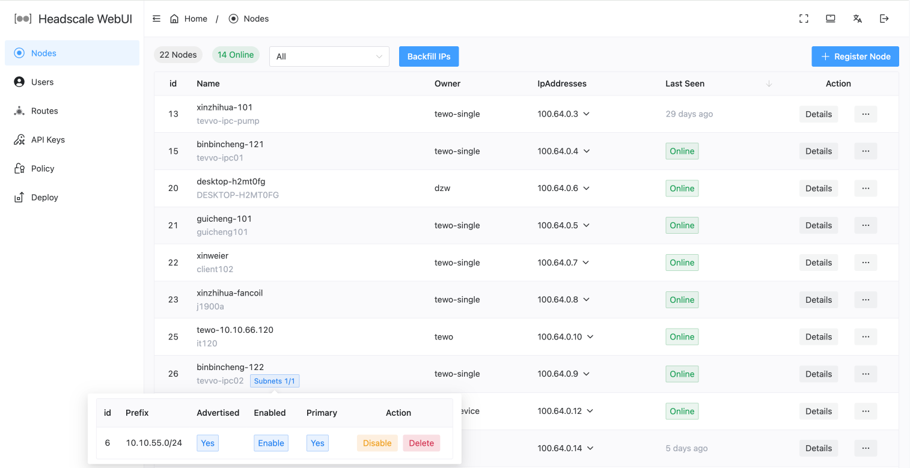
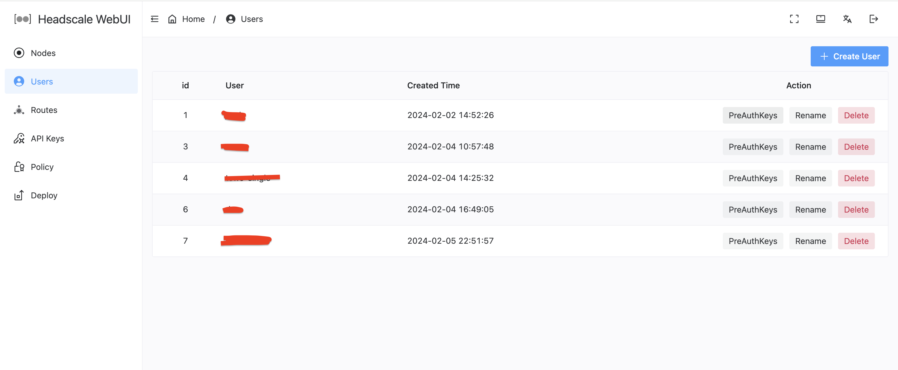
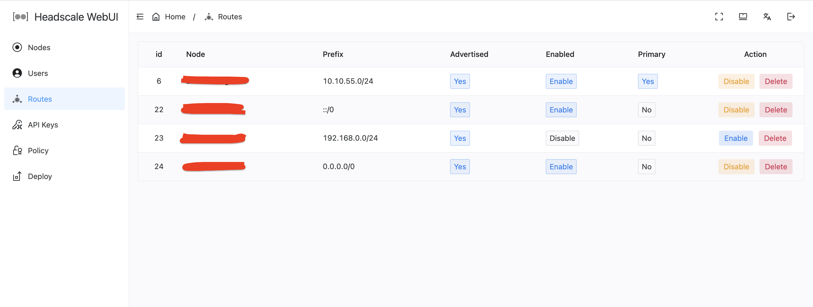
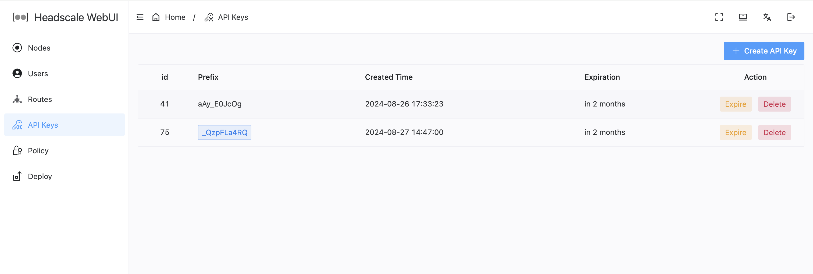
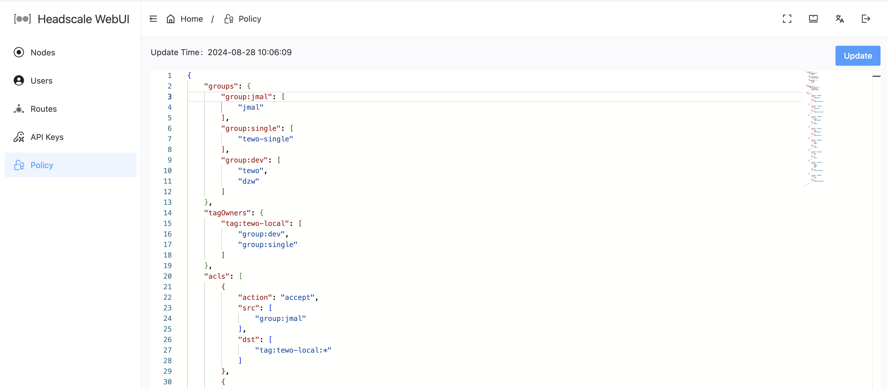
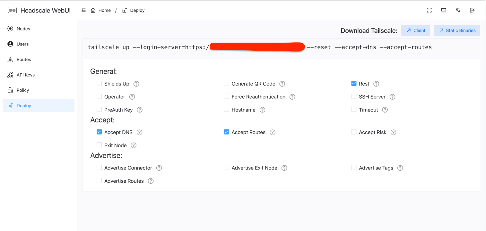

# headscale-webui
A Tailscale-compatible orchestration server web front-end for [headscale](https://github.com/juanfont/headscale)

Supported Headscale series: Headscale v0.25.x.

Choose an image tag based on your upgrade policy:

- `0.0.6-hs0.25` is an immutable tag that pins a fixed WebUI and Headscale compatibility combination.
- `hs0.25` is a movable alias that tracks the latest WebUI release compatible with Headscale v0.25.x.
- `latest` tracks the latest WebUI release. `latest` does not guarantee compatibility with older Headscale versions.

For reproducible deployments, pin `0.0.6-hs0.25`. Use `hs0.25` when you want compatible fixes for the same Headscale series. Before upgrading Headscale, verify that the selected image tag supports the target series.

### Some screenshots:







## Install

### Environment Variable

| Variable | Description                  | Example           |
|----|------------------------------|-------------------|
| VITE_APP_NAME | Project Name                 | `Headscale WebUI` |
| VITE_DEFAULT_LANG | Default Language, `enUS` or `zh_CN` | `enUS`            |

### Deploy to Netlify
Netlify is amazing, so if you're in need of somewhere to host your own version of this project, I highly recommend it.

[](https://app.netlify.com/start/deploy?repository=https://github.com/jamebal/headscale-webui)

### Docker Compose

```yaml
services:
  headscale-webui:
    image: jmal/headscale-webui:hs0.25
    restart: unless-stopped
    ports:
      - 4567:80
```

### Dev

```shell
git clone https://github.com/jamebal/headscale-webui
cd headscale-webui
```

```shell
npm install
```
```
npm run dev
```
