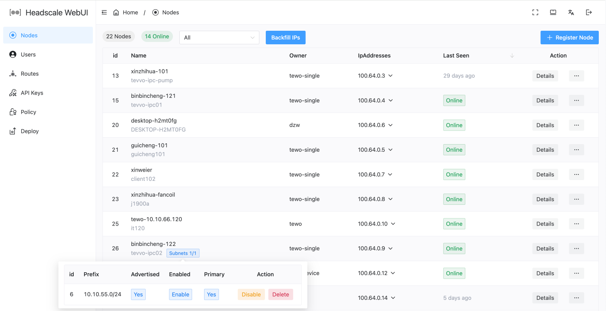
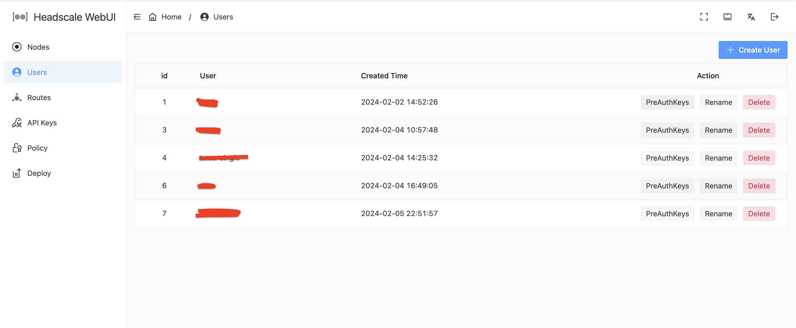
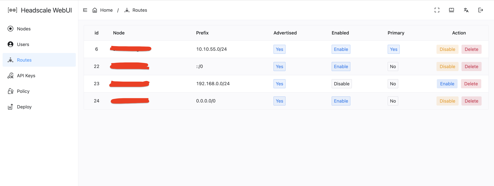
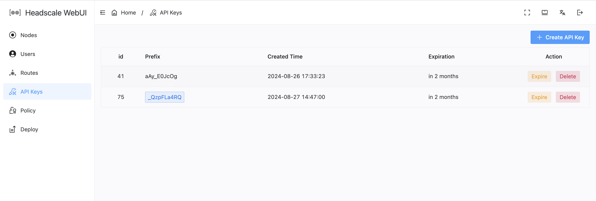
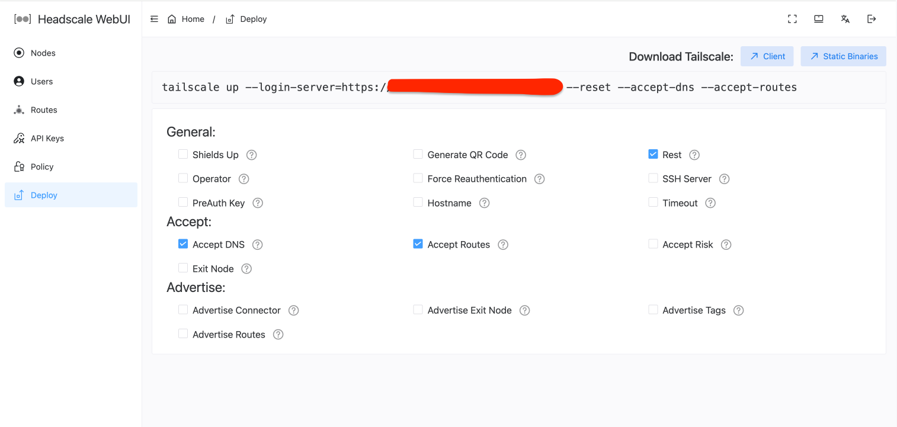

# headscale-webui
A Tailscale-compatible orchestration server web front-end for [headscale](https://github.com/juanfont/headscale)

Supported Headscale version: [v0.23.0](https://github.com/juanfont/headscale/releases/tag/v0.23.0)

### Some screenshots:







## Install

### Environment Variable

| Variable | Description                  | Example           |
|----|------------------------------|-------------------|
| VITE_APP_NAME | Project Name                 | `Headscale WebUI` |
| VITE_DEFAULT_LANG | Default Language, `enUS` or `zh_CN` | `enUS`            |

### Deploy to Netlify
Netlify is amazing, so if you're in need of somewhere to host your own version of this project, I highly recommend it.

[](https://app.netlify.com/start/deploy?repository=https://github.com/jamebal/headscale-webui)

### Docker Compose

```yaml
services:
  headscale-webui:
    image: jmal/headscale-webui
    restart: unless-stopped
    ports:
      - 4567:80
```

### Dev

```shell
git clone https://github.com/jamebal/headscale-webui
cd headscale-webui
```

```shell
npm install
```
```
npm run dev
```
