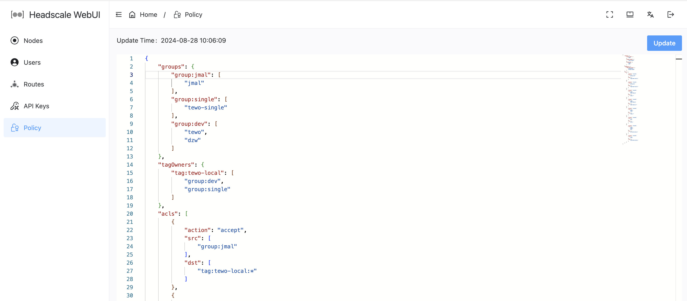

# headscale-webui

一个与 Tailscale 兼容的编排服务器 Web 前端，用于 [headscale](https://github.com/juanfont/headscale)

支持的Headscale版本: : [v0.23.0-beta2](https://github.com/juanfont/headscale/releases/tag/v0.23.0-beta2)

### 部份截图:



## 安装

### 环境变量

| Variable | Description                  | Example           |
|----|------------------------------|-------------------|
| VITE_APP_NAME | 项目名称                | `Headscale WebUI` |
| VITE_DEFAULT_LANG | 默认语言, `enUS` or `zh_CN` | `zh_CN`           |

### 部署到 Netlify

Netlify 非常棒，因此如果你需要一个地方来托管你自己版本的这个项目，我强烈推荐它。

[](https://app.netlify.com/start/deploy?repository=https://github.com/jamebal/headscale-webui)

### Docker Compose

```yaml
services:
  headscale-webui:
    image: jmal/headscale-webui
    restart: unless-stopped
    ports:
      - 4567:80
```

### Dev

```shell
git clone https://github.com/jamebal/headscale-webui
cd headscale-webui
```

```shell
npm install
```
```
npm run dev
```
